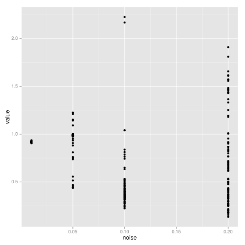
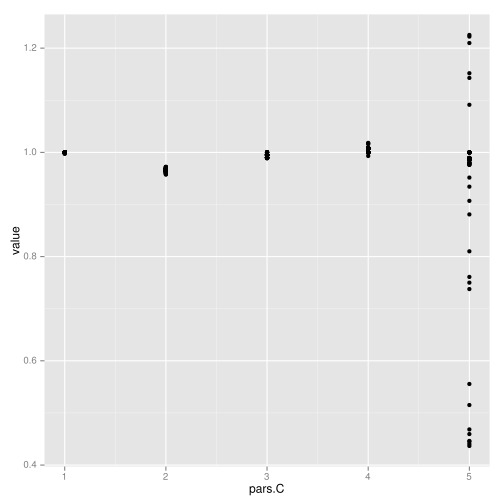

```r
library("nonparametricbayes") 
library("pdgControl")
library("ggplot2") 
library("reshape2")
library("plyr")
library("data.table")
```

```
## data.table 1.9.2  For help type: help("data.table")
```

```r
opts_chunk$set(dev="svg")
```


```r
models <- c("Myers","Allen")

parameters <- list(Myers = list(
  c(r=1.5 + rnorm(1, 0, .1), theta=2.5 + rnorm(1, 0, .1), K=8 + rnorm(1, 0, .2)),
  c(r=1.5 + rnorm(1, 0, .1), theta=2.5 + rnorm(1, 0, .1), K=8 + rnorm(1, 0, .2)),
  c(r=1.5 + rnorm(1, 0, .1), theta=2.5 + rnorm(1, 0, .1), K=8 + rnorm(1, 0, .2))),
                   Allen = list(
  c(r=2 + rnorm(1, 0, .1), K=8 + rnorm(1, 0, .1), C=5 + rnorm(1, 0, .2)),
  c(r=2 + rnorm(1, 0, .1), K=8 + rnorm(1, 0, .1), C=5 + rnorm(1, 0, .2)),
  c(r=2 + rnorm(1, 0, .1), K=8 + rnorm(1, 0, .1), C=5 + rnorm(1, 0, .2)))
                   )
nuisance_pars <- c("sigma_g")
nuisance_values <- list(sigma_g = c(0.01, 0.05, 0.1))
replicates <- c(1111, 2222, 3333, 4444, 5555, 6666, 7777, 8888) # seeds


sensitivity <- function(model, parameters, nuisance, seed){
  
  if(model == "Myers")
    f <- Myers
  else if(model == "Allen")
    f <- RickerAllee
    
sigma_g <- nuisance[["sigma_g"]]
p <- parameters
sigma_m <- 0.0
z_g <- function() rlnorm(1, 0, sigma_g)
z_m <- function() 1
x_grid <- seq(0, 15, length=50)
h_grid <- x_grid
profit <- function(x,h) pmin(x, h)
delta <- 0.01
OptTime <- 50  # stationarity with unstable models is tricky thing
reward <- 0
xT <- 0
Xo <- 5.5# observations start from
x0 <- 8 # simulation under policy starts from
Tobs <- 40
MaxT <- 1000 # timeout for value iteration convergence

  
  # replicate over random seed
  yields <- sapply(seed, 
                   function(seed_i){
                     set.seed(seed_i)
                     
                     x <- numeric(Tobs)
                     x[1] <- Xo
                     nz <- 1
                     for(t in 1:(Tobs-1))
                       x[t+1] = z_g() * f(x[t], h=0, p=p)
                     
                     X = c(rep(0,nz), pmax(rep(0,Tobs-1), x[1:(Tobs-1)]))
                     Y = c(rep(0,nz), x[2:Tobs])
                     
                     ## @knitr gp-priors
                     s2.p <- c(5,5)  
                     d.p = c(10, 1/0.1)
                     
                     ## @knitr gp
                     gp <- gp_mcmc(X, y=Y, n=1e5, s2.p = s2.p, d.p = d.p)
                     gp_dat <- gp_predict(gp, x_grid, burnin=1e4, thin=300)
                     
                     matrices_gp <- gp_transition_matrix(gp_dat$Ef_posterior, gp_dat$Vf_posterior, x_grid, h_grid) 
                     opt_gp <- value_iteration(matrices_gp, x_grid, h_grid, MaxT, xT, profit, delta, reward)
                     
                     ## @knitr mle-opt
                     matrices_true <- f_transition_matrix(f, p, x_grid, h_grid, sigma_g)
                     opt_true <- value_iteration(matrices_true, x_grid, h_grid, OptTime=MaxT, xT, profit, delta=delta)
                     
                     OPT = data.frame(GP = opt_gp$D, True = opt_true$D)
                     policies <- melt(data.frame(stock=x_grid, sapply(OPT, function(x) x_grid[x])), id="stock")
                     names(policies) <- c("stock", "method", "value")
                     
                     sims <- lapply(OPT, function(D){
                       set.seed(1)
                       lapply(1:100, function(i) 
                         ForwardSimulate(f, p, x_grid, h_grid, x0, D, z_g, profit=profit, OptTime=OptTime)
                              )
                       })
                     
                     dat <- melt(sims, id=names(sims[[1]][[1]]))
                     sims_data <- data.table(dat)
                     setnames(sims_data, c("L1", "L2"), c("method", "reps")) 
                     # Legend in original ordering please, not alphabetical: 
                     sims_data$method = factor(sims_data$method, ordered=TRUE, levels=names(OPT))
                     
                     Profit <- sims_data[, sum(profit), by=c("reps", "method")]
                     tmp <- dcast(Profit, reps ~ method)
                     tmp <- tmp / tmp[,"True"]
                     tmp <- melt(tmp[2:dim(tmp)[2]])
                     tmp$value[tmp$variable == "GP"]  
                     })
  
  yields_dat <- melt(yields)
  names(yields_dat) <- c("replicate", "simulation", "value")
  
  # Make ids factors, not integers
  yields_dat$replicate <- as.factor(yields_dat$replicate)
  yields_dat$simulation <- as.factor(yields_dat$simulation)
  
  
  # definitions of id codes.  In this case the id number is it's own definition.  
  rep_ids <-  levels(yields_dat$replicate)
  names(rep_ids) <- rep_ids
  sim_ids <-  levels(yields_dat$simulation)
  names(sim_ids) <- sim_ids  
  
  
  
  dat <- data.frame(model = model, 
                    pars = as.list(parameters), 
                    replicate = yields_dat$replicate, 
                    sim = yields_dat$simulation, 
                    value = yields_dat$value, 
                    noise = sigma_g)
}


sigmas <- c(0.01, 0.05, 0.1, 0.2)
allee <- c(1,2,3,4,5)
vary_sigma <- lapply(sigmas, function(s) 
                     try(sensitivity("Allen", 
                   parameters = c(r=2,K=8,C=5), 
                   nuisance = c(sigma_g = s), 
                   seed=c(1234))))
```

```
## Using V1 as value column: use value.var to override.
## No id variables; using all as measure variables
## Using V1 as value column: use value.var to override.
## No id variables; using all as measure variables
## Using V1 as value column: use value.var to override.
## No id variables; using all as measure variables
## Using V1 as value column: use value.var to override.
## No id variables; using all as measure variables
```

```r
vary_allee <-  lapply(allee, function(a) try(sensitivity("Allen", 
                   parameters = c(r=2,K=8,C=a), 
                   nuisance = c(sigma_g = 0.05), 
                   seed=c(1234))))
```

```
## Using V1 as value column: use value.var to override.
## No id variables; using all as measure variables
## Using V1 as value column: use value.var to override.
## No id variables; using all as measure variables
## Using V1 as value column: use value.var to override.
## No id variables; using all as measure variables
## Using V1 as value column: use value.var to override.
## No id variables; using all as measure variables
## Using V1 as value column: use value.var to override.
## No id variables; using all as measure variables
```

```r
save(list=c("vary_sigma", "vary_allee"), file="trends.rda")

vary_sigma <- melt(vary_sigma, id=names(vary_sigma[[1]]))
vary_allee <- melt(vary_allee, id=names(vary_allee[[1]]))
```


```r
plot_s <- ggplot(vary_sigma, aes(noise, value)) + geom_point()
plot_s
```

 

```r
ggsave("vary_sigma.pdf")
```

```
## Saving 7 x 7 in image
```

```r
plot_a <- ggplot(vary_allee, aes(pars.C, value)) + geom_point()
plot_a
```

 

```r
ggsave("vary_allee.pdf")
```

```
## Saving 7 x 7 in image
```


