#


This report was automatically generated with the R package **knitr**
(version 1.5.32).


```r
cbPalette <- c("#000000", "#E69F00", "#56B4E9", "#009E73", 
               "#F0E442", "#0072B2", "#D55E00", "#CC79A7")
```

```r
library("methods")
library("knitr")

library("nonparametricbayes") 
library("pdgControl")

library("ggplot2") 
library("reshape2")
library("plyr")
library("data.table")

library("R2jags")
library("emdbook") # for as.mcmc.bugs (?)
library("coda")  # for as.mcmc

library("modeest")
library("MASS")

opts_knit$set(fig.path="figure/small-allee/")

opts_chunk$set(fig.width=6, fig.height=6, echo=FALSE, dev="svg", warning=FALSE, message=FALSE, echo=FALSE)
theme_set(theme_bw(base_size=12))
toggle = "hide" # results argument


load("small-allee.rda")
```
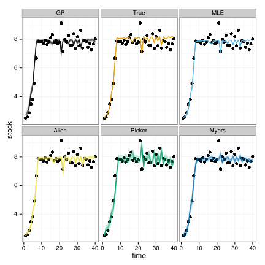

```
## \begin{table}[ht]
## \begin{center}
## \begin{tabular}{rrrr}
##   \hline
##  & Allen & Ricker & Myers \\ 
##   \hline
## DIC & 46.68 & 87.73 & 63.51 \\ 
##   AIC & -21.09 & -69.17 & -39.96 \\ 
##   BIC & -14.34 & -64.11 & -33.20 \\ 
##    \hline
## \end{tabular}
## \end{center}
## \end{table}
```

```
## \begin{table}[ht]
## \begin{center}
## \begin{tabular}{rrrr}
##   \hline
##  & Allen & Ricker & Myers \\ 
##   \hline
## DIC & 46.68 & 87.73 & 63.51 \\ 
##   AIC & -21.09 & -69.17 & -39.96 \\ 
##   BIC & -14.34 & -64.11 & -33.20 \\ 
##    \hline
## \end{tabular}
## \caption{Model selection scores for several common criteria all (wrongly) select the simplest model. As the true (Allen) model is not distinguishable from the simpler (Ricker) model in the region of the observed data, this error cannot be avoided regardless of the model choice criterion. This highlights the danger of model choice when the selected model will be used outside of the observed range of the data.}
## \end{center}
## \end{table}
```
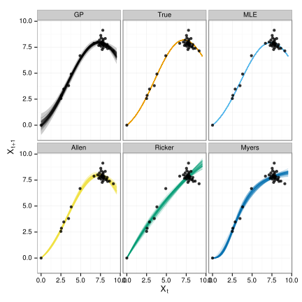
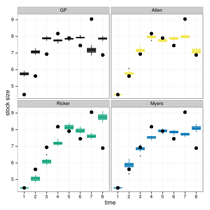
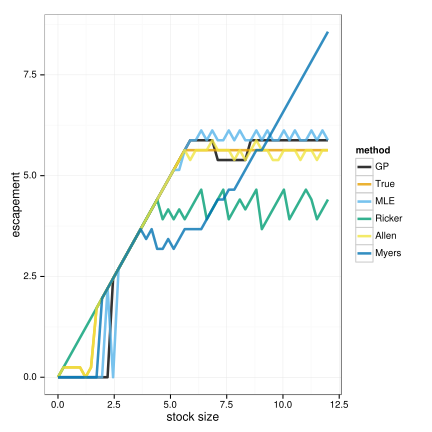
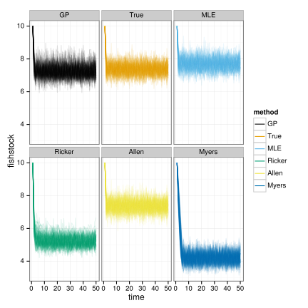
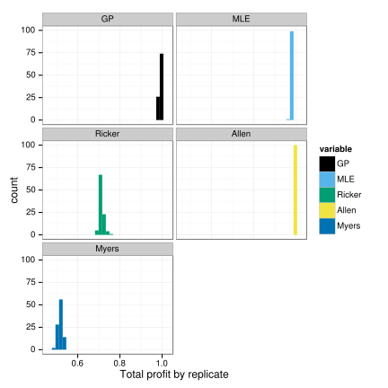
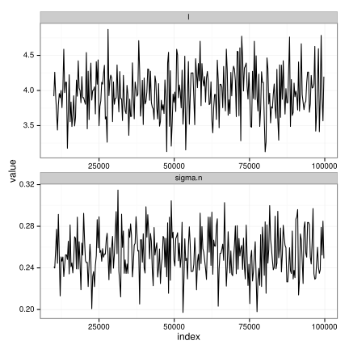
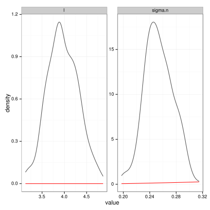
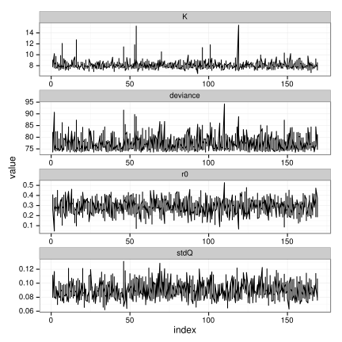
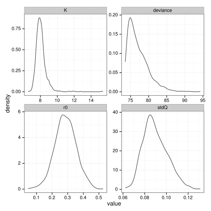
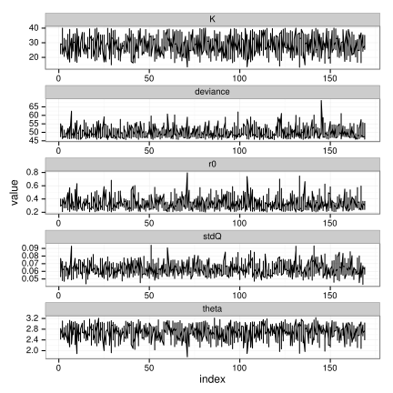
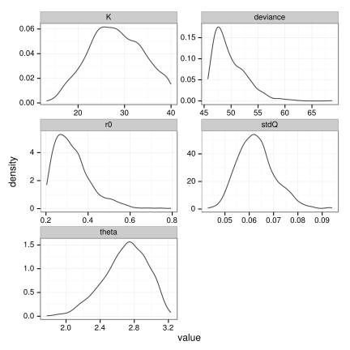
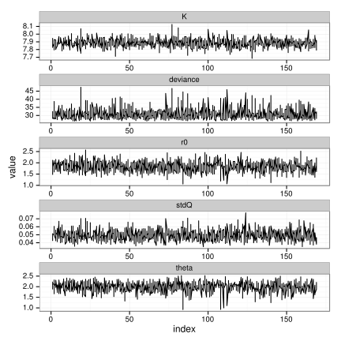
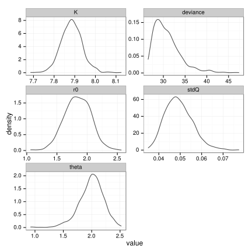


The R session information (including the OS info, R version and all
packages used):


```
## R version 3.1.0 (2014-04-10)
## Platform: x86_64-pc-linux-gnu (64-bit)
## 
## locale:
##  [1] LC_CTYPE=en_US.UTF-8       LC_NUMERIC=C              
##  [3] LC_TIME=C                  LC_COLLATE=C              
##  [5] LC_MONETARY=C              LC_MESSAGES=en_US.UTF-8   
##  [7] LC_PAPER=en_US.UTF-8       LC_NAME=C                 
##  [9] LC_ADDRESS=C               LC_TELEPHONE=C            
## [11] LC_MEASUREMENT=en_US.UTF-8 LC_IDENTIFICATION=C       
## 
## attached base packages:
## [1] stats     graphics  grDevices datasets  utils     methods   base     
## 
## other attached packages:
##  [1] pander_0.3.8             modeest_2.1             
##  [3] emdbook_1.3.4            MASS_7.3-33             
##  [5] R2jags_0.04-01           rjags_3-13              
##  [7] coda_0.16-1              lattice_0.20-29         
##  [9] data.table_1.9.2         plyr_1.8.1              
## [11] reshape2_1.4.0.99        ggplot2_1.0.0           
## [13] pdgControl_0.0-2         nonparametricbayes_0.0-2
## [15] knitr_1.5.32             devtools_1.5            
## 
## loaded via a namespace (and not attached):
##  [1] Formula_1.1-1       Hmisc_3.14-4        Matrix_1.1-3       
##  [4] R2WinBUGS_2.1-19    RColorBrewer_1.0-5  RCurl_1.95-4.1     
##  [7] Rcpp_0.11.1         abind_1.4-0         boot_1.3-11        
## [10] cluster_1.15.2      colorspace_1.2-4    cubature_1.1-2     
## [13] digest_0.6.4        evaluate_0.5.5      expm_0.99-1.1      
## [16] formatR_0.10        grid_3.1.0          gtable_0.1.2       
## [19] highr_0.3           httr_0.3            kernlab_0.9-19     
## [22] labeling_0.2        latticeExtra_0.6-26 markdown_0.7       
## [25] mcmc_0.9-3          memoise_0.2.1       mime_0.1.1         
## [28] munsell_0.4.2       parallel_3.1.0      proto_0.3-10       
## [31] scales_0.2.4        snowfall_1.84-6     splines_3.1.0      
## [34] stringr_0.6.2       survival_2.37-7     tools_3.1.0        
## [37] whisker_0.3-2       xtable_1.8-1
```

```
## [1] "2014-05-23 14:28:23 PDT"
```

